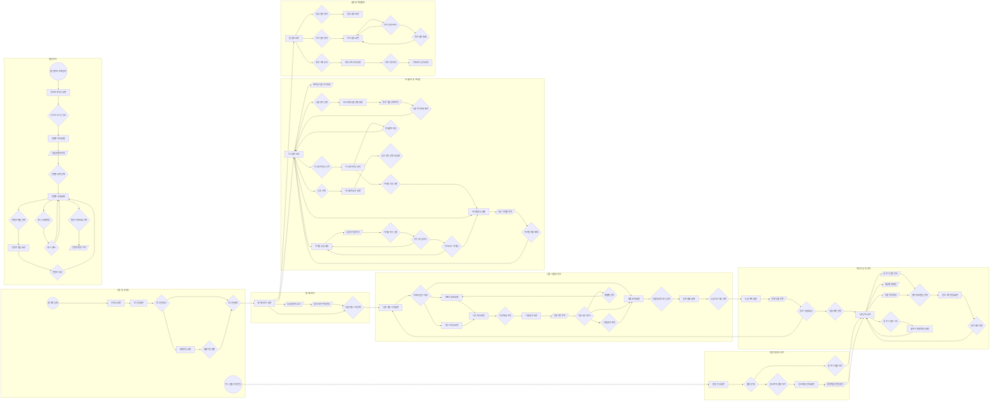

```mermaid
flowchart LR

  subgraph s1 ["인증 및 온보딩"]
    n1(("앱 최초 실행"))
    n2(("푸시 알림 터치 진입"))
    n3["온보딩 화면"]
    n4["로그인 화면"]
    n5{"로그인 여부?"}
    n6["회원가입 화면"]
    n7{"로그인 완료"}
    n8{"회원가입 완료"}
  end

  subgraph s2 ["홈 대시보드"]
    n9["홈 대시보드 화면"]
    n10[/"오늘의 관리 요약"/]
    n11[/"날씨 기반 주의 안내"/]
    n12{"식물 식별 시작 선택"}
  end

  subgraph s3 ["식물 식별 및 등록"]
    n13["식물 식별 시작 화면"]
    n14{"카메라 권한 허용?"}
    n15["카메라 촬영 화면"]
    n16["사진 보관함 화면"]
    n17["사진 확인 화면"]
    n18{"사진 제출 확정"}
    n19["식별 결과 화면"]
    n20[/"식물 후보 목록"/]
    n21{"식별 성공 여부?"}
    n22{"식별 결과 확정"}
    n23{"재촬영 선택"}
    n24["직접 등록 화면"]
    n25{"식물명 검색 또는 입력"}
    n26["등록 완료 화면"]
    n27{"도감으로 이동 선택"}
  end

  subgraph s4 ["개인 도감 및 관리"]
    n28["도감 목록 화면"]
    n29[/"등록 식물 목록"/]
    n30{"등록 식물 있음?"}
    n31{"식물 항목 선택"}
    n32["식물 상세 화면"]
    n33[/"식물 관리 정보"/]
    n34[/"증상별 대처법"/]
    n35[/"물 주기 일정 정보"/]
    n36{"관리 정보 편집 선택"}
    n37["관리 기록 편집 화면"]
    n38{"관리 정보 저장"}
    n39{"물 주기 완료 기록"}
    n40["물 주기 완료 확인 화면"]
  end

  subgraph s5 ["알림 및 날씨 관리"]
    n41["알림 수신 화면"]
    n42{"알림 유형?"}
    n43{"물 주기 알림 터치"}
    n44{"날씨 주의 알림 터치"}
    n45["날씨 위험 안내 화면"]
    n46[/"환경 위험 판단 결과"/]
  end

  subgraph s6 ["미니홈피 및 아이템"]
    n47["미니홈피 화면"]
    n48[/"배치된 식물 미니어처"/]
    n49{"식물 추가 선택"}
    n50["미니어처 식물 선택 화면"]
    n51[/"등록 식물 선택 목록"/]
    n52{"식물 미니어처 배치"}
    n53{"미니홈피 편집 선택"}
    n54["미니홈피 편집 화면"]
    n55{"아이템 적용 선택"}
    n56{"미니홈피 저장"}
    n57{"공유 선택"}
    n58["미니홈피 공유 화면"]
    n59{"공유 방식 선택 및 실행"}
    n60["아이템 창고 화면"]
    n61[/"보유 아이템 목록"/]
    n62{"아이템 적용·해제"}
    n63["아이템 상점 화면"]
    n64[/"상점 아이템 목록"/]
    n65{"획득 조건 충족?"}
    n66{"아이템 획득 선택"}
    n67{"이미 보유 아이템?"}
  end

  subgraph s7 ["설정 및 개인정보"]
    n68["앱 설정 화면"]
    n69{"알림 설정 변경"}
    n70["알림 설정 화면"]
    n71{"지역 설정 변경"}
    n72["지역 설정 화면"]
    n73{"위치 권한 허용?"}
    n74{"위치 권한 철회"}
    n75{"계정 삭제 요청"}
    n76["계정 삭제 확인 화면"]
    n77{"삭제 최종 확인"}
    n78["삭제 처리 결과 화면"]
  end

  subgraph s8 ["웹 관리자"]
    n79(("웹 관리자 최초 접속"))
    n80["관리자 로그인 화면"]
    n81{"관리자 로그인 완료"}
    n82["콘텐츠 목록 화면"]
    n83[/"식물 콘텐츠 목록"/]
    n84{"콘텐츠 항목 선택"}
    n85["콘텐츠 상세 화면"]
    n86[/"콘텐츠 변경 이력"/]
    n87{"콘텐츠 편집 선택"}
    n88["콘텐츠 편집 화면"]
    n89{"콘텐츠 저장"}
    n90{"게시 상태 변경"}
    n91{"게시 상태?"}
    n92{"변경 이력 조회 선택"}
  end

  n1 --> n3
  n3 --> n4
  n4 --> n5
  n5 --> n7
  n5 --> n6
  n6 --> n8
  n8 --> n7
  n7 --> n9
  n2 --> n41
  n9 --> n10
  n10 --> n11
  n11 --> n12
  n9 --> n12
  n12 --> n13
  n13 --> n14
  n14 --> n15
  n14 --> n16
  n14 --> n24
  n15 --> n17
  n16 --> n17
  n17 --> n18
  n18 --> n19
  n19 --> n20
  n20 --> n21
  n21 --> n22
  n21 --> n23
  n21 --> n24
  n22 --> n24
  n23 --> n15
  n24 --> n25
  n25 --> n26
  n26 --> n27
  n27 --> n28
  n28 --> n29
  n29 --> n30
  n30 --> n31
  n30 --> n13
  n31 --> n32
  n32 --> n33
  n32 --> n34
  n32 --> n35
  n35 --> n36
  n33 --> n36
  n36 --> n37
  n37 --> n38
  n38 --> n32
  n32 --> n39
  n39 --> n40
  n40 --> n32
  n41 --> n42
  n42 --> n43
  n42 --> n44
  n43 --> n32
  n44 --> n45
  n45 --> n46
  n46 --> n32
  n9 --> n47
  n47 --> n48
  n47 --> n49
  n49 --> n50
  n50 --> n51
  n51 --> n52
  n52 --> n47
  n47 --> n53
  n53 --> n54
  n54 --> n55
  n55 --> n60
  n54 --> n56
  n56 --> n47
  n47 --> n57
  n57 --> n58
  n58 --> n59
  n47 --> n60
  n60 --> n61
  n61 --> n62
  n62 --> n47
  n47 --> n63
  n63 --> n64
  n64 --> n66
  n66 --> n65
  n65 --> n67
  n65 --> n63
  n67 --> n60
  n67 --> n63
  n9 --> n68
  n68 --> n69
  n69 --> n70
  n68 --> n71
  n71 --> n72
  n72 --> n73
  n73 --> n72
  n73 --> n74
  n74 --> n72
  n68 --> n75
  n75 --> n76
  n76 --> n77
  n77 --> n78
  n79 --> n80
  n80 --> n81
  n81 --> n82
  n82 --> n83
  n83 --> n84
  n84 --> n85
  n85 --> n87
  n87 --> n88
  n88 --> n89
  n89 --> n85
  n85 --> n90
  n90 --> n91
  n91 --> n85
  n91 --> n85
  n85 --> n92
  n92 --> n86
```
